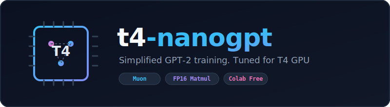

<p align="center">
  
</p>

<p align="center">
  <em>A simplified GPT-2 training setup descended from the NanoGPT speedrun, adapted for neural net optimization research and tuned to run on a single T4 GPU.</em>
</p>
<hr>

## Overview

Trains a 162M-parameter GPT-2-scale model on [FinewebEDU-10B](https://huggingface.co/datasets/kjj0/finewebedu10B-gpt2) using:

- **NorMuonH** optimizer — Newton-Schulz orthogonalized gradients (Muon) with Adafactor-style row/column variance preconditioning and a hyperball Frobenius-norm-preserving update step
- **Custom FP16 scaled matmul** — avoids FP16 overflow during forward and backward passes without requiring BF16 hardware
- **Half-truncated RoPE** positional embeddings with base frequency tuning
- **relu²** MLP activation
- Softcapped logits (`15 * tanh(logits / 15)`)
- Optional **SigReg** regularization losses on hidden representations

## Files

```
train.py              # Main training script (modular, imports from src/)
train_simple.py       # Self-contained single-file version of train.py
colab_T4.ipynb        # Ready-to-run Colab notebook (same as train_simple.py)

src/
  matmul.py           # Custom FP16 scaled matmul forward/backward ops
  model.py            # GPT model: RMSNorm, Rotary, CausalSelfAttention, MLP, Block, GPT
  optimizer.py        # NorMuonH optimizer + Newton-Schulz5 + scale_invariant_update
  reg.py              # SigReg regularization losses (weak, strong, discrete, zipfian)
  data.py             # Dataset download helper and data generator
```

`train_simple.py` and `colab_T4.ipynb` are equivalent — the notebook is the easiest way to get started, while `train_simple.py` is the same code as a plain Python script. `train.py` is the modular version that imports from `src/`.

## Quickstart

### Google Colab (recommended)

Open `colab_T4.ipynb` in Google Colab with a T4 GPU runtime and run all cells. Data is downloaded automatically from Hugging Face.

You can either download from this repo or open this public Colab link ([https://colab.research.google.com/drive/1kwgmUAGDaPh4uLjShEPZh_R2vy8JailX?usp=sharing]())

### Local

```bash
pip install torch huggingface_hub
python train.py
# or the single-file version:
python train_simple.py
```

Data shards are downloaded on first run to `./finewebedu10B/`.

## Model Architecture

| Hyperparameter  | Value  |
| --------------- | ------ |
| Vocabulary size | 50,304 |
| Layers          | 12     |
| Model dimension | 768    |
| Head dimension  | 128    |
| MLP expansion   | 4×    |
| Parameters      | ~162M  |
| Sequence length | 1,024  |

## Training Setup

| Setting               | Value                                                  |
| --------------------- | ------------------------------------------------------ |
| Batch size            | 8 × 64 × 1024 tokens                                 |
| Microbatch size       | 8                                                      |
| NorMuonH lr (weights) | 0.035                                                  |
| AdamW lr (embeddings) | 0.3                                                    |
| LR schedule           | Linear cooldown (full run for NorMuonH, 40% for AdamW) |
| Gradient clipping     | 1.0                                                    |

## SigReg Regularization

Set `REG_MODE` and `SIGR_ALPHA` to apply a regularization penalty on block hidden states:

| `REG_MODE` | Loss                                                |
| ------------ | --------------------------------------------------- |
| `baseline` | None (disabled)                                     |
| `weak`     | Covariance → identity (whitening)                  |
| `discrete` | Normalized covariance → identity                   |
| `strong`   | Characteristic function distance from Gaussian      |
| `zipfian`  | Angular orthogonality + Zipf magnitude distribution |

`SIGR_ALPHA` controls the blend: `loss = (1 - alpha) * ce_loss + alpha * reg_loss`.

## Optimizer: NorMuonH

NorMuonH combines three ideas:

1. **Newton-Schulz orthogonalization** of the gradient (5 iterations)
2. **Adafactor-style variance preconditioning** along the short axis of each weight matrix
3. **Hyperball update** — each step is scaled by `lr × ‖param‖ / ‖update‖` and the parameter is renormalized back to its original Frobenius norm, making weight decay unnecessary

Each weight shape class (QKV, MLP-fc, attn-proj, mlp-proj) gets its own optimizer instance so `torch.compile` can cache separate kernels per shape.

## Hardware

Tested on T4, L4, V100, A100, H100. MFU is logged during training. The default peak FLOP assumption is 65 TFLOPS (T4); this is auto-detected from `torch.cuda.get_device_name()`.

### T4 Benchmark (1 data shard, 100M tokens)

| Metric              | Value                       |
| ------------------- | --------------------------- |
| Steps               | 190                         |
| Avg time per step   | 66,582 ms (66.5 s)          |
| Total training time | 12,770.84 s (3 h 32 m 50 s) |
| Train loss          | 4.750                       |
| Val loss            | 4.72264                     |
| MFU                 | 13.2%                       |

### H100 Benchmark (1 data shard, 100M tokens, BF16 activations)

| Metric              | Value                |
| ------------------- | -------------------- |
| Steps               | 190                  |
| Avg time per step   | 1,270 ms (1.27 s)    |
| Total training time | 299.203 s (4 m 59 s) |
| Train loss          | 4.990                |
| Val loss            | 4.96310              |
| MFU                 | 45.2%                |

## Experimental

### LFM2 Hybrid Architecture (`experimental/lfm2-nanogpt.ipynb`)

A hybrid model replacing most attention blocks with LFM2 gated short convolutions, run on 2× T4 GPUs (Kaggle).

**Architecture changes from baseline:**

- 9 of 12 blocks use `LFM2Conv` (gated depthwise conv1d, kernel size 3) from the [LFM2 paper](https://arxiv.org/abs/2511.23404), replacing full self-attention
- The remaining 3 blocks (positions 2, 6, 10) use `CausalSelfAttention` with [Canon layers](https://arxiv.org/abs/2512.17351): causal conv1d residuals added to Q, K, and V projections before SDPA to replace RoPE
- Attention blocks include sigmoid gating on the output
- Optimizer: AdamW + Muon (instead of NorMuonH)

Block interleaving pattern (12 layers):

```
LFM2, LFM2, Attn, LFM2, LFM2, LFM2, Attn, LFM2, LFM2, LFM2, Attn, LFM2
```

**Results (1 data shard, 100M tokens, 2× T4):**

| Metric              | Value       |
| ------------------- | ----------- |
| Steps               | 190         |
| Avg time per step   | 32,480 ms   |
| Total training time | 6,244.933 s |
| Train loss          | 4.398       |
| Val loss            | 4.37842     |
| MFU                 | 13.7%       |

Compared to the single-T4 baseline, the hybrid model achieves significantly lower loss (val 4.378 vs 4.723) in roughly half the wall-clock time, at similar MFU. The improved loss reflects both the hybrid architecture and the 2× GPU setup enabling a larger effective batch.

## References

- [NanoGPT speedrun](https://github.com/KellerJordan/modded-nanogpt) — upstream codebase
- [NorMuon paper](https://arxiv.org/pdf/2510.05491) — optimizer basis
- [FinewebEDU-10B dataset](https://huggingface.co/datasets/kjj0/finewebedu10B-gpt2)
- [LFM2 paper](https://arxiv.org/abs/2511.23404) — gated short convolutions
- [Canon layers](https://arxiv.org/abs/2512.17351) — causal conv1d residuals for Q, K, V projections
